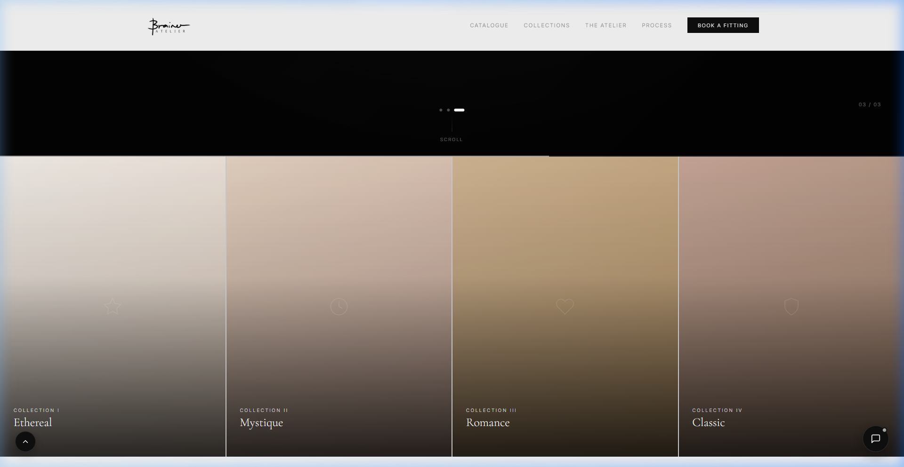
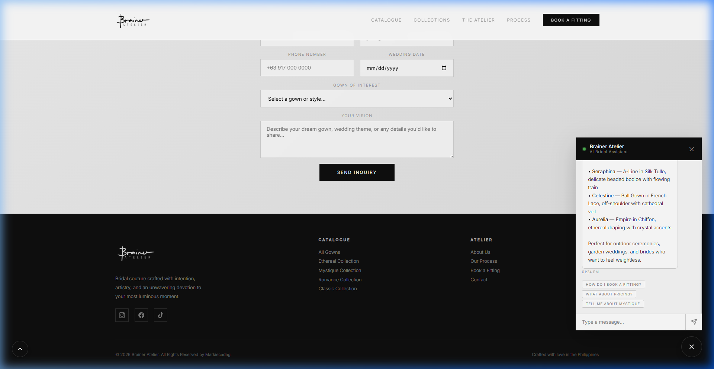

# Brainer Atelier — Bridal Catalogue 💍

A stunning, high-performance static web application for a boutique bridal atelier, built with HTML, CSS, and Vanilla JavaScript, integrated with a Firebase backend.

## Features ✨

*   **Ethereal Design**: Custom CSS with glassmorphism, smooth micro-animations, and a responsive grid layout.
*   **Dynamic Catalogue**: 12 gowns spread across 4 distinct collections (Ethereal, Mystique, Romance, Classic) with filtering capabilities.
*   **Interactive Lightbox**: Immersive image viewing with keyboard navigation (`Left/Right` arrows) and smooth transitions.
*   **Smart AI Chatbot**: A fully local, fuzzy-matching intelligent assistant capable of answering questions across 20+ bridal topics and suggesting context-aware follow-ups—all without needing an API key.
*   **Firebase Integration**: Secure inquiry form that connects directly to a Cloud Firestore database, protected by custom security rules.
*   **Performance Optimized**: Image lazy loading, CSS animations, and efficient vanilla JS logic.

## Screenshots 📸

### The Collections


### The Catalogue & Filtering


### The AI Bridal Assistant


## Tech Stack 🛠️

*   **Frontend**: HTML5, CSS3, Vanilla JS
*   **Backend**: Google Firebase (Cloud Firestore)
*   **Hosting Setup**: Ready for Firebase Hosting
*   **Design Tokens**: Custom variables for colors (Ivory, Cream, Rose, Charcoal, Gold) and typography.

## Setup & Local Development 💻

1. Clone this repository.
2. Serve the directory using any local web server. For example, using Node.js:
   ```bash
   npx serve .
   ```
3. Open `http://localhost:3000` in your browser.

## Firebase Configuration 🔥

This project is configured to write inquiries securely to a Cloud Firestore database.

To initialize your own Firebase environment:
1. Create a Firebase project in the [Firebase Console](https://console.firebase.google.com/).
2. Enable **Firestore Database** in production mode.
3. Update the `firebaseConfig` object inside `assets/js/main.js` with your project's credentials.
4. Deploy the included security rules:
   ```bash
   firebase deploy --only firestore:rules
   ```

---
*Bridal couture crafted with intention, artistry, and an unwavering devotion to your most luminous moment. All rights reserved.*
